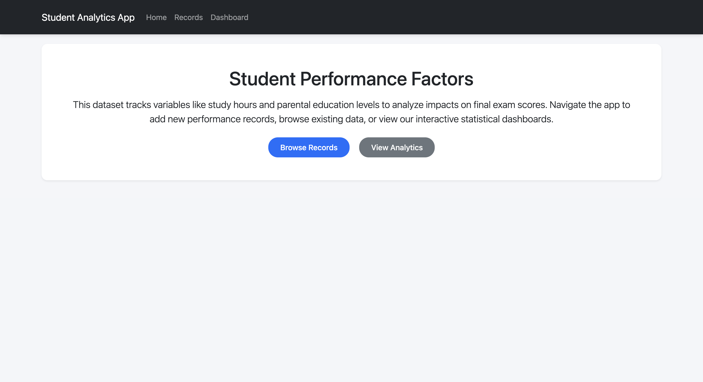
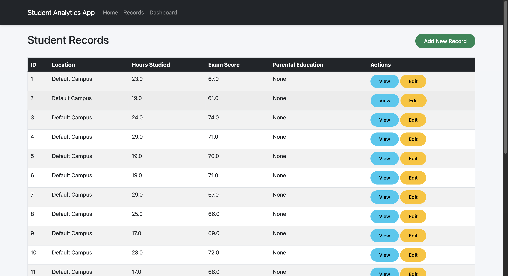
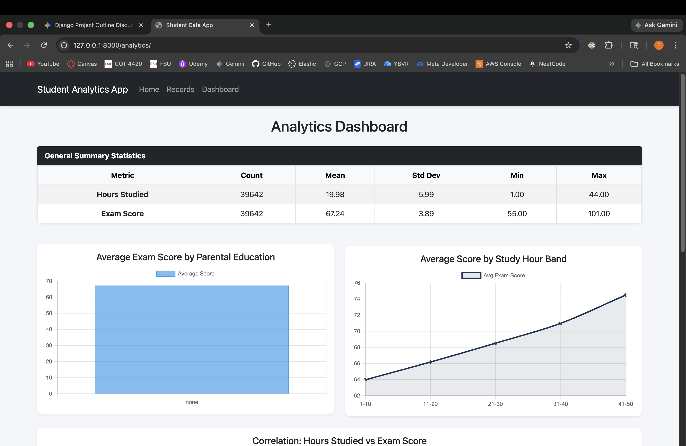

# Student Performance Analytics | Group 16

**Group Members:**
- Eric Fidalgo - ef22r
- Thomas Hoppel - tah22a

## Overview

A Django-based web app for analyzing how various factors, ranging from study habits to local weather, impact student exam scores. The project combines static performance metrics with live data from the Open-Meteo API to identify correlations between environment and academic outcomes.

## Tech Stack

  * **Backend:** Django (Python)
  * **Data Processing:** Pandas
  * **Frontend:** Chart.js, HTML/CSS
  * **API:** Open-Meteo (Weather Data)

-----

## Core Features

  * **Student Management:** Full CRUD functionality to view, create, update, and delete performance records.
  * **Analytics Dashboard:** Visual representation of data using Pandas for aggregation and Chart.js for interactive bar and scatter plots.
  * **Live Data Integration:** Staff-level access to trigger real-time weather data fetches via external API.
  * **Dynamic Pagination:** Optimized record viewing for large datasets.

## Routes

| Path | Function |
| :--- | :--- |
| `/` | Project Landing Page |
| `/records/` | Paginated Student List |
| `/records/<pk>/` | Individual Record Detail |
| `/analytics/` | Data Visualizations & Stats |
| `/fetch/` | Open-Meteo API Sync (Staff Only) |

-----

## Screenshots

### Homepage


### Student Records List


### Analytics Dashboard


-----

## Quick Start

1.  **Clone the repo:**
    ```bash
    git clone https://github.com/EricFidalgo/cis4930-sp26-django-project-group-16
    cd cis4930-sp26-django-project-group-16
    ```
2.  **Install dependencies:**
    ```bash
    pip install -r requirements.txt
    ```
3.  **Run Migrations:**
    ```bash
    python manage.py migrate
    ```
4.  **Start Server:**
    ```bash
    python manage.py runserver
    ```
